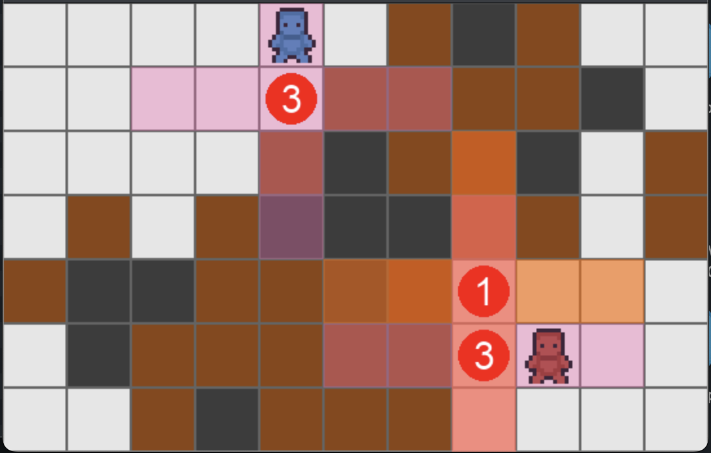

# Reinforcement-Learning-Game

A reinforcement learning environment created to allow development of reinforcement learning algorithms, including basic solutions.



[Watch the Demo Video](docs/Demo%20Video.mov)

## The Challenge

Use my Bomberman-inspired game environment (Py3) to explore and train reinforcement learning algorithms (MCTS, DQN, Genetic Algorithms, and more) to develop an unbeatable AI agent.

Instructions on how to install this environment can be found below.

## Solutions

**A. Deep Q Network (DQN)**

Basic implementation is complete.


**B. Genetic Algorithms (GA) - In Progress**

Currently randomly plays games to collect data for future selection.


**C. Monte Carlo Tree Search (MCTS) - In Progress**

High potential for a good solution (ref. AlphaGo and Chess), but still needs to be added. 

**D. Minimax algorithm - In Progress**

High potential for a good solution (ref. AlphaGo and Chess), but still needs to be added. 

## Quick Start Guide

Follow these steps to get started:

1.  **Clone the Repository**:
    ```bash
    git clone https://github.com/splovyt/Reinforcement-Learning-Game.git
    cd Reinforcement-Learning-Game
    ```

2.  **Install Dependencies**:
    Make sure you have Python 3 (preferably 3.9+) installed. Then, install the required packages:
    ```bash
    python3 -m pip install -r requirements.txt
    ```
    (It's recommended to do this within a Python virtual environment.)

3.  **Understanding Pre-trained Models**:
    This project includes several pre-trained models located in the `models/best_models/` directory.
    Currently, there are 7 models. However, due to environment updates, only the following three QRDQN models works with the latest version of the game environment:
    *   `qrdqn_20250602-225719_final.zip`
    *   `qrdqn_20250603-161836_final.zip` (Best One)
    *   `qrdqn_best_20250530-205110_final.zip`

    The other older models (`best_bomber.zip`, `best_destroyer.zip`, `final_continued_bomber.zip`, `improved_bomber.zip`) were trained on a previous version of the environment and does not work at all.

4.  **Watch a Trained Agent Play**:
    To see a trained agent in action against a static opponent, run:
    ```bash
    python3 test_trained_agent.py --model-path "models/best_models/qrdqn_20250603-161836_final.zip" --episodes 3
    ```
    *   `--model-path`: Path to the agent model.
    *   `--episodes`: Number of games to play.
    *   Use `--no-render` for faster, non-visual execution.
    *   Use `--stochastic` for the agent to use stochastic (non-deterministic) actions.

5.  **Play Against a Trained Agent**:
    Challenge a trained agent yourself! You'll control one player, and the AI will control the other.
    ```bash
    python3 play_vs_agent.py --model-path "models/best_models/qrdqn_20250603-161836_final.zip"
    ```
    *   **Your Controls (Player 2 - Red Bomber)**:
        *   `W`: Up
        *   `S`: Down
        *   `A`: Left
        *   `D`: Right
        *   `SPACE`: Place Bomb
        *   `E`: Stand Still
        *   `Q`: Quit Game

## Environment Details

### Rewards and Punishments

| Reward/Punishment             | Condition                                                                                                                               | Value          |
|-------------------------------|-----------------------------------------------------------------------------------------------------------------------------------------|----------------|
| Strategic Bomb Placement      | Given if the agent places a bomb that is predicted to destroy a soft wall or a hard wall. Prediction based on pre-action board state. | +5.0 points    |
| Ineffective Move Penalty      | Deducted if agent chooses a move action (Up, Down, Left, Right) but its position does not change after game updates.                  | -5.0 points    |
| Wall Break Reward             | Given for every soft wall the agent destroys in the current step.                                                                       | +50.0 points   |
| Wall Break Survival Bonus     | Given if agent is still alive at the end of the step in which it successfully broke one or more walls.                                  | +100.0 points  |
| Stagnation Penalty            | Deducted if 10 game turns pass without the agent breaking any walls, provided there are still walls remaining. Resets turn count.       | -20.0 points   |
| Exploration Reward            | Given when the agent moves to a tile it has not visited before during the current episode.                                              | +100.0 points  |
| Repetitive 'Still' Action Penalty | Deducted if agent performs 'Still' action three times in a row. Action history cleared after penalty.                                 | -5.0 points    |
| Repetitive 'Bomb' Action Penalty | Deducted if agent performs 'Bomb' action three times in a row. Action history cleared after penalty.                                  | -5.0 points    |
| Successful Dodge Reward       | Given if agent was on a tile that explodes in current step, but successfully moved to a different, safe tile within that same step.    | +50.0 points   |
| Death Penalty                 | Deducted if agent dies. Terminates current episode.                                                                                     | -200.0 points  |

### Agent's Observation Information

The agent receives its information about the game world as a 3D array (specifically, a 7x11x10 tensor). This array consists of 10 different layers, each representing a specific aspect of the game state:

| Layer Name                     | Constant (in code)         | Description                                                                                                |
|--------------------------------|----------------------------|------------------------------------------------------------------------------------------------------------|
| Walls Layer                    | `OBS_LAYER_WALLS`          | Shows locations of soft walls. 1.0 for soft wall, 0.0 otherwise.                                           |
| Hard Walls Layer               | `OBS_LAYER_HARD_WALLS`     | Shows locations of hard walls. 1.0 for hard wall, 0.0 otherwise.                                           |
| Player Position Layer          | `OBS_LAYER_PLAYER_POS`     | Marks agent's current position. 1.0 at agent's (row, col), 0.0 elsewhere.                                  |
| Opponent Position Layer        | `OBS_LAYER_OPPONENT_POS`   | Marks opponent's current position (static dummy). 1.0 at opponent's (row, col), 0.0 elsewhere.             |
| Bombs Layer                    | `OBS_LAYER_BOMBS`          | Indicates locations of active bombs. 1.0 for bomb, 0.0 otherwise.                                          |
| Danger Zone - TTE 0            | `OBS_LAYER_DANGER_TTE0`    | Highlights tiles in an explosion happening in current game tick (TTE=0). 1.0 for blast radius, 0.0 otherwise. |
| Danger Zone - TTE 1            | `OBS_LAYER_DANGER_TTE1`    | Highlights tiles that will explode in next game tick (TTE=1). 1.0 if bomb causes explosion, 0.0 otherwise.   |
| Danger Zone - TTE 2            | `OBS_LAYER_DANGER_TTE2`    | Highlights tiles that will explode in 2 game ticks (TTE=2). 1.0 if bomb causes explosion, 0.0 otherwise.    |
| Danger Zone - TTE 3            | `OBS_LAYER_DANGER_TTE3`    | Highlights tiles that will explode in 3 game ticks (TTE=3). 1.0 if bomb causes explosion, 0.0 otherwise.    |
| Danger Zone - TTE 4+           | `OBS_LAYER_DANGER_TTE4_PLUS` | Highlights tiles that will explode in 4+ game ticks (TTE>=4). 1.0 if bomb causes explosion, 0.0 otherwise. |

### Future Improvements

-   Cannot place two bombs in a row (punishment)
-   Escape reward should be based on how many walls we break

## Training Your Own Agent

This environment is designed to be compatible with reinforcement learning libraries like Stable Baselines3.

1.  **Environment Import**:
    The main environment class is `BomberEnv` located in `bomber_env_new.py`. You can import and instantiate it as follows:
    ```python
    from bomber_env_new import BomberEnv
    
    # For training (no rendering, faster)
    env = BomberEnv(render_mode=None) 
    
    # For visualization during or after training
    # env = BomberEnv(render_mode="human") 
    ```

2.  **Training Script Example**:
    A basic training script `train_bomberman_agent.py` is provided, demonstrating how to train a QRDQN agent using Stable Baselines3. You can adapt this script for your own algorithms or to experiment with different hyperparameters.
    ```bash
    python3 train_bomberman_agent.py
    ```
    The script will save the trained model and logs.

3.  **Custom Training**:
    To implement your own training logic or use different RL algorithms:
    *   Ensure your agent interacts with the environment using the standard Gymnasium (formerly OpenAI Gym) API (`step`, `reset`, `render`, `close`).
    *   The observation space and action space are defined within `BomberEnv`.
    *   Refer to the documentation of your chosen RL library (e.g., [Stable Baselines3](https://stable-baselines3.readthedocs.io/)) for guidance on setting up custom training loops.

This environment provides a foundation for developing and testing RL agents in a Bomberman-like setting. Modify the reward structure, game mechanics (`game.py`), or observation space in `bomber_env_new.py` to create new challenges for your agents.

